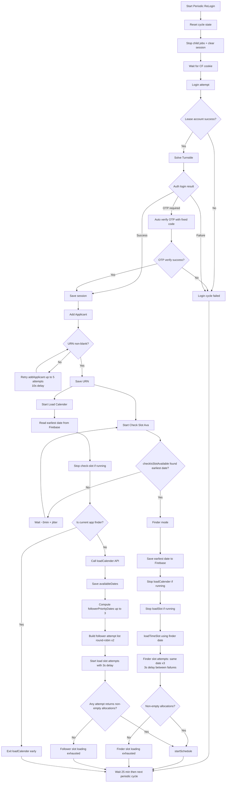

# Full Cycle Flow (Periodic + Finder/Follower)

## Operational Notes

1. Periodic cycle starts by fully resetting state and jobs, then performs login.
2. Login uses mission/country from leased account payload for auth requests.
3. `addApplicant` is crash-safe: max 5 attempts, 10s fixed retry delay, success requires non-blank URN.
4. After `addApplicant` success, `startCheckIsSlotAvailable()` and `loadCalender()` run in parallel.
5. Finder app is the first app that gets earliest date from check-slot in current cycle.
6. Finder writes earliest date to Firebase, preempts calendar/slot jobs, then loads slot.
7. Finder slot loading retries the same date at least 3 times with 3s delay between failures.
8. Follower reads earliest date from Firebase, stops check-slot, then loads calendar API dates.
9. Follower computes per-device prioritized dates and tries up to 3 dates over 2 rounds.
10. Delay between failed follower slot attempts is 3s.
11. Slot load success means non-empty allocation IDs; then `startSchedule(...)` is triggered.
