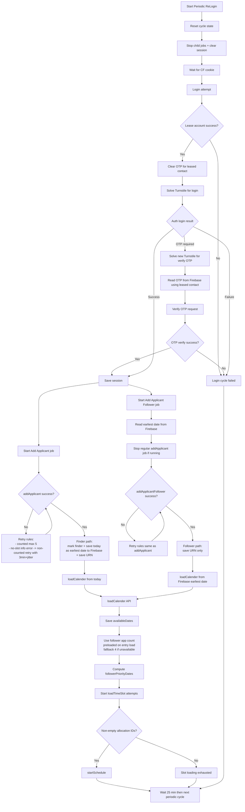

# Full Cycle Flow (Periodic + Finder/Follower)

## Operational Notes

1. Periodic cycle resets and logs in every 25 minutes while active.
2. Login and verify-OTP use separate captcha token solves.
3. OTP submit reads OTP from Firebase using leased contact number.
4. After login success, both add-applicant jobs start in parallel.
5. Regular add-applicant success marks finder and writes today's date (`dd/MM/yyyy`) to Firebase.
6. Follower add-applicant first reads earliest date from Firebase and stops regular add-applicant if it is running.
7. No-slot informational error (`code:10673` or matching message text) does not consume counted add-applicant retries and uses 3min+jitter delay.
8. `loadCalender` now uses explicit `fromDate` (today for finder path, Firebase earliest for follower path).
9. Follower app count is fetched from backend by entry `(countryCode, missionCode)` and cached on entry load.
10. Fallback follower app count is `4` if backend follower-number API is unavailable/invalid.
11. HTTP trace logging is standardized to one `HTTP START` and one `HTTP END` per request with request/response previews.
